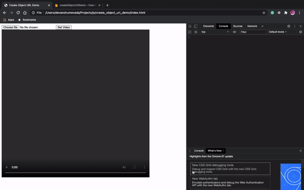

### URL.createObjectURL Tutorial

Suppose we have a case wherein a video file chosen  by the user via the input tag is to be set as a source to the HTML video tag.

Now, either simply setting the src of the video element to input_tag_reference.files[0] (for which a file not found or local resources not allowed to be accessed errors will be generated depending on the browser) or setting the src to input_tag_reference.value (for which browser gives a fake URL path) won't work.

Basically, we need to generate a object URL via URL.createObjectURL and then set the object url created as the src of the video element tag. Object URLs returned will have a format similar to "blob:null/669cda8b-821f-47ab-8a9c-e0a4f902d413"
and will be bound to a particular instace of its access i.e. every time to refresh / reload the web page, a new object URL will be generated for the same input file selected.

I kindly request you to have a look at this discussion on [stackoverflow](https://stackoverflow.com/questions/30864573/what-is-a-blob-url-and-why-it-is-used) for a detailed understanding and walkthrough of these object URLs.

I have created a sample web page to demonstrate this. [Click Here](https://createobjecturldemo.web.app) to try it out and don't forget to have a look at the console as it logs both the fake url and the object url for a particular file. Please have a look at the index.html file in this repository for the code of the sample page.

